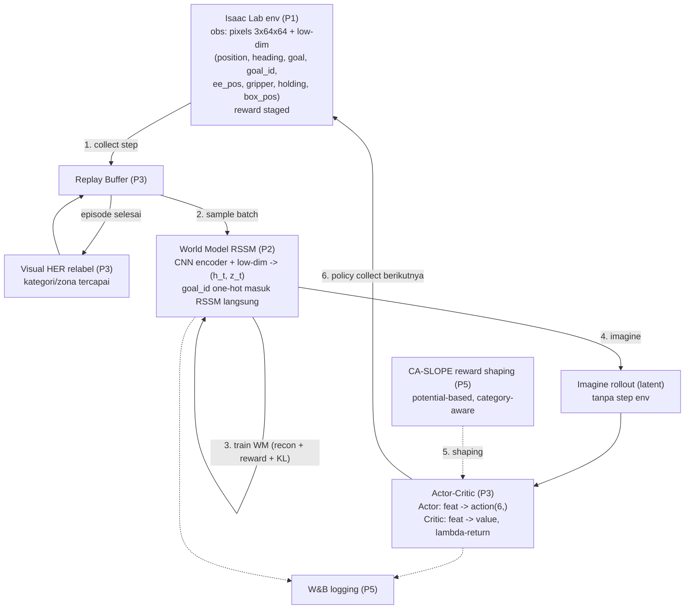
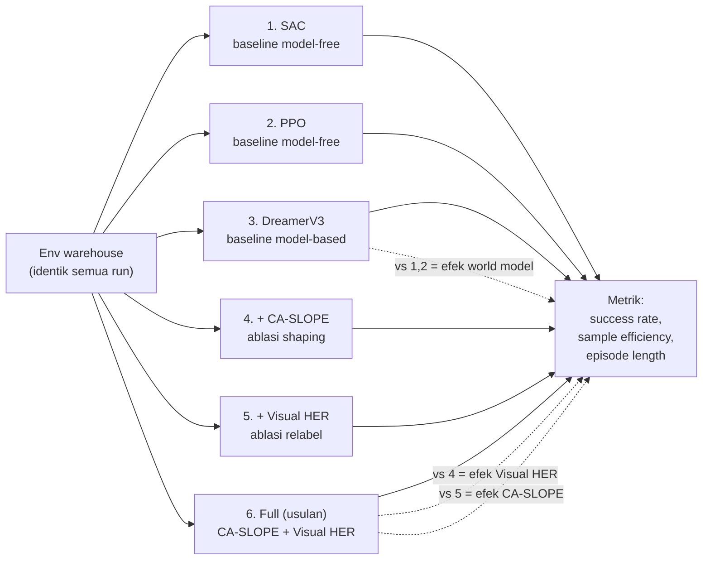
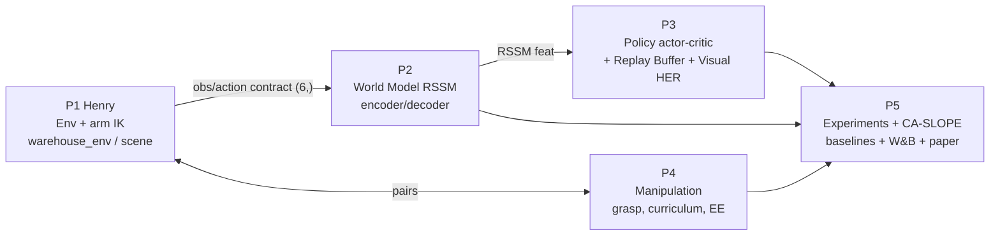

# Workflow & Metode — Visual Goal-Conditioned World Model for Warehouse Pickup

> Fakta: `proposal/docs/01-project-facts.md` + `docs/research/referensi.md`. `[#n]` = entri referensi.md.
> Diagram mermaid (render di GitHub / VS Code Mermaid Preview).

---

## A. Workflow training (per-step loop — DreamerV3)

Policy belajar di "imajinasi" world model, bukan step env terus-menerus → hemat sample (sim lambat).

---

## B. Workflow eksperimen (6 konfigurasi)

Faktorial 2x2 (CA-SLOPE x Visual HER) di atas DreamerV3 + 2 baseline model-free.

---

## C. Workflow tim (pipeline integrasi)

---

## Metode yang dipakai

| Metode | Peran | Referensi |
|---|---|---|
| DreamerV3 (RSSM + actor-critic in imagination) | backbone world model | [#1], lineage [#2,#3] |
| DifferentialIK (Jacobian-based) | arm `(ee_dx,dy,dz)` -> joint target | [#8] |
| Visual HER | relabel episode gagal (kategori/zona tercapai) | [#11,#12,#13], survey [#14] |
| CA-SLOPE (potential-based reward shaping, category-aware) | dense reward jaga optimality | [#15] Ng1999, [#16] |
| Curriculum (nav -> grasp -> full -> anneal goal) | staging belajar | [#17] |
| Baseline SAC / PPO | pembanding model-free | [#18,#19] |
| TD-MPC2 | pembanding model-based non-Dreamer | [#5] |
| Goal-conditioning via `goal_id` one-hot | 1 policy, multi-kategori | survey [#14] |

Precedent terdekat: **DayDreamer [#4]** (https://arxiv.org/abs/2206.14176) — Dreamer di robot pick-place visual + reward sparse.

> Nomor `[#n]` merujuk `docs/research/referensi.md`. Jangan sitasi di luar daftar tervalidasi itu.

---

## Penjelasan Metode (bahasa mudah)

### 1. DreamerV3 — World Model (RSSM + actor-critic in imagination)
Analogi: pemain catur yang **membayangkan** beberapa langkah ke depan di kepala sebelum jalan, bukan coba-coba di papan beneran.
- **World model (RSSM)** = "imajinasi" robot. Jaringan saraf yang belajar menebak: *kalau aku di kondisi ini lalu lakukan aksi ini, kondisi & reward berikutnya jadi apa?* RSSM = memori berulang (recurrent) yang meringkas kondisi dunia jadi kode kecil (latent).
- **Actor-critic in imagination** = robot berlatih **di dalam imajinasi**, bukan di simulator. Actor = pemutus aksi; Critic = penilai "posisi ini bagus atau tidak".
- Kenapa: step sim Isaac lambat/mahal. Latihan di imajinasi murah → ribuan percobaan khayalan dari sedikit data nyata. **Hemat sample.** [#1]

### 2. DifferentialIK — kontrol lengan
Analogi: mau ujung jari menyentuh satu titik; otak otomatis mengatur sudut bahu-siku-pergelangan. IK = "otak" itu untuk robot.
- Robot diberi perintah **"gerakkan ujung lengan (EE) ke sini"** (`ee_dx,dy,dz`). IK menghitung **sudut 7 joint** agar EE sampai, pakai Jacobian (hubungan kecepatan joint ↔ kecepatan EE).
- Tanpa IK harus atur 7 sudut joint manual. IK membuat kontrol lengan jadi "tunjuk titik, selesai". [#8]

### 3. Visual HER — belajar dari kegagalan
Analogi: disuruh ambil gelas merah, malah ambil gelas biru. Daripada "gagal, nilai 0", anggap saja *tadi memang disuruh ambil biru — dan berhasil*. Tetap dapat pelajaran.
- Masalah: reward **sparse** (poin hanya kalau sukses total). Robot sering gagal → 0 sinyal → susah belajar.
- HER (Hindsight Experience Replay): **relabel** episode gagal seakan goal-nya = yang **benar-benar tercapai**. Kegagalan jadi contoh sukses → robot tetap belajar cara ambil & antar.
- "**Visual**" = relabel berdasar **apa yang robot fisik lakukan** (box/zona yang didekati), bukan hanya posisi. Kontribusi P3. [#11,#12,#13]

### 4. CA-SLOPE — reward shaping (potential-based)
Analogi: main "panas-dingin". Daripada hanya bilang "ketemu/tidak" di akhir, beri petunjuk terus: "makin panas... makin dingin." Robot belajar lebih cepat.
- Reward asli sparse (hanya di akhir). **Shaping** = tambah reward kecil tiap langkah: makin **dekat** ke box/zona → reward naik sedikit. Ada penuntun terus-menerus.
- "**Potential-based**" (teorema Ng 1999): cara menambah petunjuk yang **dijamin tidak mengubah solusi optimal** (robot tidak belajar yang salah demi mengejar petunjuk). `F = γΦ(s') − Φ(s)`.
- "**CA**" (category-aware) = petunjuknya **sadar kategori** (baca `goal_id`) → tahu box/zona mana yang benar untuk dituntun. Kontribusi P5. [#15,#16]

### 5. Curriculum — belajar bertahap
Analogi: belajar naik sepeda pakai roda bantu dulu, baru dilepas. Tidak langsung lomba.
- Task susah (nav+grasp+carry+place sekaligus) dipecah dari gampang ke susah:
  `nav-only` (box sudah di tangan) → `grasp-only` → `full chain` → `anneal goal` (petunjuk posisi zona dihapus perlahan; robot harus pakai mata + `goal_id`).
- Belajar bertahap > langsung susah (sering gagal total kalau langsung full). [#17]

### 6. Baseline SAC / PPO — pembanding model-free
Analogi: murid yang belajar **murni coba-coba langsung** (tanpa membayangkan dulu). Untuk mengukur: apakah world model benar lebih baik?
- **Model-free** = tidak punya "imajinasi"; belajar langsung dari interaksi. **SAC** (off-policy, efisien data) + **PPO** (on-policy, stabil) = dua algoritma standar.
- Dipakai sebagai **garis dasar**: kalau DreamerV3 mengalahkan ini di sample efficiency → bukti world model berguna. [#18,#19]

### 7. TD-MPC2 — pembanding model-based lain
Analogi: pemain yang juga "membayangkan", tapi caranya beda (planning langsung tiap langkah, bukan melatih actor di imajinasi).
- Juga punya world model, tapi pakai **MPC planning** (merencanakan aksi tiap step). Pembanding kuat untuk membuktikan pilihan **DreamerV3** memang cocok untuk task ini, bukan asal pilih. [#5]

### 8. Goal-conditioning via `goal_id` — satu policy banyak tugas
Analogi: satu pegawai serba bisa yang diberi **kartu perintah** ("ambil yang kecil"/"ambil yang besar"), bukan 3 pegawai berbeda.
- `goal_id` = one-hot `[fragile, regular, heavy]` = **perintah** kategori mana yang diambil + zona mana.
- Satu policy belajar **semua kategori** sekaligus (dikondisikan ke `goal_id`), bukan melatih model terpisah per kategori. Efisien + general. [#14]
