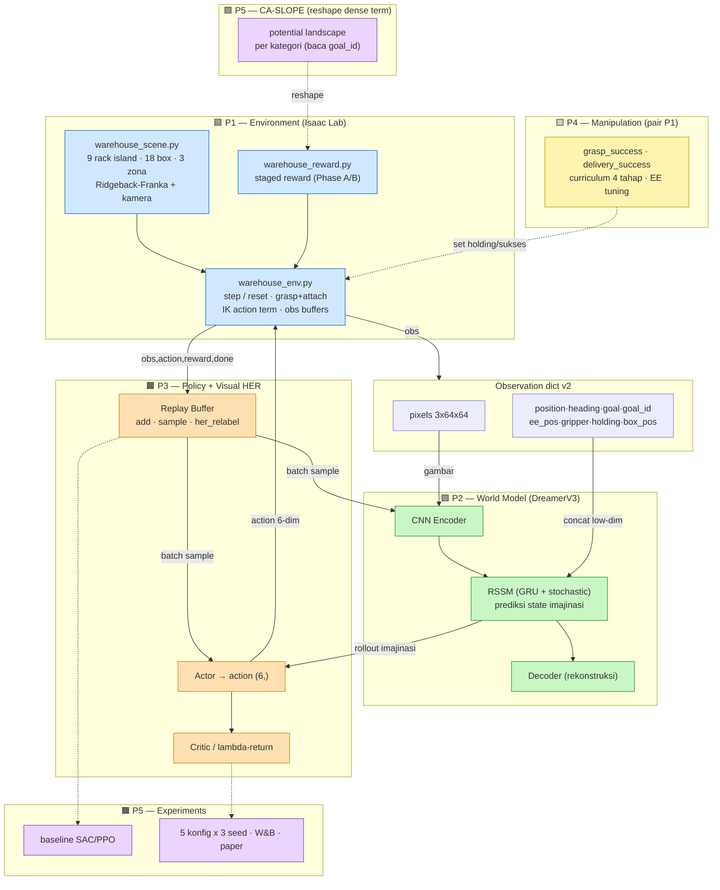
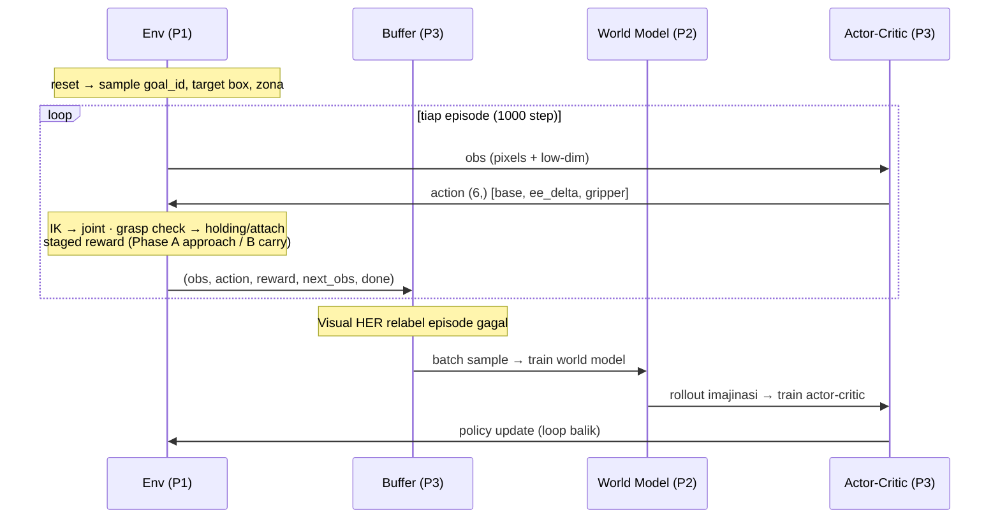
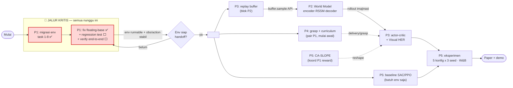

# Pembagian Tugas — Per Orang (Spesifik)

> Visual Goal-Conditioned World Model untuk Warehouse Pickup · Tim 5 orang · pure DL
> Turunan konkret dari: `docs/superpowers/specs/2026-06-08-pure-dl-pickup-redesign.md` (source of truth),
> `docs/superpowers/plans/2026-06-08-env-pickup-migration.md` (plan P1), `docs/project/project_overview.md`, `docs/project/timeline_terbaru.md`.
> Dokumen ini menjawab "siapa ngerjain apa, file mana, kapan kelar" — bukan ringkasan visi.

## Cara baca dokumen ini
Tiap orang punya: **Output** (deliverable nyata), **File** (yang dibuat/disentuh), **Interface** (kontrak ke orang lain — JANGAN diubah sepihak), **Depends on** (nunggu siapa), **Definition of Done** (kapan dianggap selesai). Interface contract = `obs` dict + `action (6,)` + `buffer` API; semua orang terikat ke sini.

---

## Kontrak Bersama (semua orang terikat)

```python
# Observation (P1 produce, P2/P3 consume) — JANGAN ubah tanpa diskusi tim
obs = {
    "pixels":   Tensor(B, 3, 64, 64),  # kamera onboard RGB [0,1]
    "position": Tensor(B, 3),          # base xyz env-local
    "heading":  Tensor(B, 2),          # [cos(yaw), sin(yaw)]
    "goal":     Tensor(B, 3),          # zona delivery xyz — ANNEAL → zeros (curriculum)
    "goal_id":  Tensor(B, 3),          # one-hot [orange,cyan,purple] — pilih box + zona
    "ee_pos":   Tensor(B, 3),          # end-effector xyz, base frame
    "gripper":  Tensor(B, 1),          # bukaan finger 0..1
    "holding":  Tensor(B, 1),          # 1.0 kalau box target ke-grasp
    "box_pos":  Tensor(B, 3),          # box target xyz — UNANNEALED
}

# Action (P3 produce, P1 consume)
action = [base_lin, base_ang, ee_dx, ee_dy, ee_dz, gripper]   # shape (6,), [-1,1]

# Replay buffer (P3 own, P2/P5 consume)
buffer.add(obs, action, reward, next_obs, done)
buffer.her_relabel(trajectory)     # Visual HER (P3)
buffer.sample(batch_size) -> batch_dict
```

Status repo per 2026-06-08: **hanya kode P1 (environment) yang ada**. Stack ML (P2–P5) belum ada satu pun di repo. Lihat `docs/project/project_overview.md` §"Status Implementasi".

---

## P1 (Henry) — Environment & Integration (+ arm IK wiring)

**Tanggung jawab:** Bikin environment Isaac Lab keluarin `obs` di atas dan terima `action (6,)`, wiring lengan Franka via IK, reward staged. Produsen kontrak — kalau interface berubah, P1 yang umumin ke tim.

**Output:**
1. Env pickup runnable end-to-end: spawn → nav → grasp → carry → place, 1 env, camera ON.
2. `obs` dict v2 lengkap (9 key), `action (6,)`, reward staged auto-switch di `holding`.
3. `tests/test_env.py` interface-contract = ALL PASS.

**File:**
- `env/warehouse_scene.py` — 54→18 box floor-level reachable (`TARGET_BOX_SPECS`), satu per rack, di depan rack dalam reach Franka ~0.85m.
- `env/warehouse_env.py` — IK action term (`DifferentialInverseKinematicsActionCfg`) + gripper term; buffer `goal_id`/`box_pos`/`holding`; grasp+kinematic-attach di `step`; space `(6,)` + Dict obs.
- `env/warehouse_reward.py` — staged reward + terminasi pickup.
- `env/action_pickup.py`, `env/grasp.py`, `env/curriculum.py` — pure-tensor (no Isaac import, unit-testable).
- `tests/test_*` (action_pickup, grasp, curriculum, reward_pickup, env), `configs/env_config.yaml` (sync ke pickup: count 18, action 6).

**Task konkret (urut, dari migration plan) — status per 2026-06-09:**
1. ✅ 18 box reachable (`a9237db`)
2. ✅ action split 6→base2+ee3+grip1 (`7b8bb2c`)
3. ✅ grasp-success/lost detection (`67c9f60`)
4. ✅ curriculum helper goal_id + anneal (`a630a1e`)
5. ✅ staged reward + terminasi di `warehouse_reward.py` (`528be0f`)
6. ✅ wiring IK action term + gripper + obs v2 buffers + grasp/attach (`0d92ed2`)
7. ✅ `test_env.py` contract v2 (`16c7b64`), sync `env_config.yaml` (`1255b89`)
8. ✅ box di bottom shelf, lift measured vs resting height (`c325b82`)

**Kode task 1-8 SELESAI.** Sisa P1 = follow-up blocker + verifikasi end-to-end:
- ✅ floating-base bug fixed (weld `world` link, `bugs_errors/2026-06-09_ridgeback-floating-base.md`) — **belum di-commit** (uncommitted di `warehouse_scene.py`)
- ⬜ commit fix floating-base + uncommitted diff (reward/scene/scripts)
- ⬜ regression test: chassis (`body_pos_w[base_link]`) translasi >0.1m di forward command + assert `is_fixed_base=True` (shape-only test sebelumnya nutupin bug ini)
- ⬜ re-verify `_base_cmd` yaw projection masih benar setelah base beneran gerak
- ⬜ run end-to-end: `run_env.py` windowed 1000 step, verify holding flip 0→1 saat grasp, reward Phase A→B switch, no crash
- ⬜ ukur VRAM nyata (18 box + arm IK aktif) — lihat `docs/research/research_isaaclab_cloud_lowvram.md`

**Interface yang P1 JAMIN:** `obs` dict v2 + `action (6,)` di atas. Referensi Isaac: `Isaac-Lift-Cube-Franka-v0` (IK action term + lift reward), `Isaac-Reach-Franka-v0`.

**Depends on:** P4 (kriteria grasp-success: finger contact + lift threshold — pair). Tidak nunggu P2/P3 untuk env standalone.

**Definition of Done:** `python tests/test_env.py --num_envs 1` (camera ON) ALL PASS dengan obs 9-key + action (6,); `run_env.py` jalan 1000 step tanpa crash; box ke-grasp via attach, holding flip 0→1, reward Phase A→B switch terverifikasi.

**Catatan blocker:** driver NVIDIA pin di **580.88** (jangan auto-update 591.x/595.x → reintroduce Blackwell camera crash). Kill zombie `python.exe` antar run.

---

## P2 — World Model core (DreamerV3 RSSM)

**Tanggung jawab:** Inti world model — encoder gambar, RSSM, decoder, training world-model. Tidak sentuh env atau policy logic.

**Output:**
1. CNN encoder: `pixels (B,3,64,64)` → latent.
2. RSSM (GRU + stochastic) prediksi state berikutnya di imajinasi.
3. Decoder rekonstruksi gambar (verifikasi kualitas WM).
4. World-model training loop dari batch replay buffer.

**File (belum ada — buat baru, mis. `world_model/`):** encoder, rssm, decoder, wm_train. Basis: `github.com/NM512/dreamerv3-torch`.

**Interface yang P2 konsumsi:**
- `pixels` → CNN encoder.
- Low-dim key (`position, heading, goal, goal_id, ee_pos, gripper, holding, box_pos`) → concat jadi low-dim obs vector → RSSM.
- `goal_id` (3-dim one-hot) feed RSSM **langsung** — TIDAK ada proyeksi CLIP 512→64 (dihapus 2026-06-08).
- `goal` anneal→zeros (curriculum), `box_pos` unannealed. **Jangan hardcode arti/shape goal.**
- Batch dari `buffer.sample(batch_size)` (P3).

**Depends on:** P1 (shape obs final), P3 (replay buffer API + batch format).

**Definition of Done:** WM training loss turun + decoder rekonstruksi gambar warehouse kebaca; RSSM rollout imajinasi keluarin trajectory yang dipakai actor-critic P3.

---

## P3 — Policy (actor-critic + training loop) + Visual HER

**Tanggung jawab:** Policy + seluruh data plumbing. Owner `buffer` API. Owner Visual HER.

**Output:**
1. Actor keluarin `action (6,)`; critic / lambda-return atas rollout imajinasi RSSM.
2. Replay buffer: `add` / `sample` / `her_relabel`.
3. Training loop: collect env step → train WM (panggil P2) → train actor-critic di imajinasi. Logging W&B (koordinasi P5).
4. **Visual HER**: relabel episode gagal (box yang ke-grasp / zona yang dicapai) seakan itu `goal_id` yang diperintah → rollout gagal tetap kasih sinyal positif.

**File (belum ada — buat baru, mis. `policy/`, `buffer/`):** actor_critic, replay_buffer, her, train_loop.

**Interface yang P3 PRODUCE (orang lain terikat):**
```python
buffer.add(obs, action, reward, next_obs, done)
buffer.her_relabel(trajectory)
buffer.sample(batch_size) -> batch_dict   # format dipakai P2 + P5
```
Actor output WAJIB `action (6,)` di `[-1,1]` sesuai kontrak P1.

**Visual HER (spec §4b):** hidup di replay buffer (relabel saat sample). Orthogonal ke CA-SLOPE P5 — keduanya feed staged reward yang sama; HER reuse off-goal experience, CA-SLOPE reshape dense term.

**Depends on:** P1 (action shape + obs), P2 (WM untuk imajinasi).

**Definition of Done:** training loop jalan end-to-end (env→buffer→WM→actor-critic); HER relabel kebukti naikin success rate vs no-HER; W&B curve kelogging.

---

## P4 — Manipulation (grasp + pick-place curriculum) — pair P1

**Tanggung jawab:** Semua soal "tangan" — deteksi grasp, kurikulum pick-place, tuning EE. Pair erat dengan P1 di arm IK.

**Output:**
1. `grasp_success` detection: finger nutup di box + box keangkat > threshold → set `holding=1`.
2. `delivery_success`: box kategori benar (per `goal_id`) di zona warna cocok, lalu dilepas.
3. Curriculum 4 tahap (spec §7): (1) carry/place pre-grasped → (2) grasp-only → (3) full chain → (4) anneal goal.
4. Tuning EE control + scaling `ee_dx/dy/dz` (reach per control step).

**File:** `env/grasp.py` (pure-tensor, pair P1), curriculum stages di `env/curriculum.py` + `warehouse_env.py`, EE scaling const.

**Interface:** baca `ee_pos, gripper, box_pos, holding, goal_id` dari obs; set flag `holding` + sukses lewat reward fn (`warehouse_reward.py`). Box ~18 graspable, ukuran encode kategori 21/32/52cm → orange/cyan/purple. Kategori DIBERI via `goal_id`, BUKAN dideteksi.

**Depends on:** P1 (env runtime, IK term). Saling-pair — P4 definisi kriteria grasp, P1 wiring Isaac-nya.

**Definition of Done:** grasp kinematic-attach reliable (>X% sukses dari pose feasible); 4 stage curriculum kepilih via param; delivery sukses cuma kalau kategori×zona cocok.

**Open item (spec §9):** verifikasi workspace Franka vs tinggi shelf (explore script), kriteria exact grasp-success (finger contact + lift threshold), konvensi base-frame vs world-frame EE target.

---

## P5 — Experiments + CA-SLOPE (RQ2) + baselines + paper

**Tanggung jawab:** Metode reward CA-SLOPE (kontribusi utama, RQ2), seluruh eksperimen, baseline, W&B infra, paper.

**Output:**
1. **Category-Aware SLOPE**: dense shaping term (`dist(ee_pos,box_pos)` Phase A, `dist(box_pos,goal_zone)` Phase B) jadi potential-based landscape **per kategori**, kategori dibaca dari `goal_id` (BUKAN vision — YOLO dihapus).
2. Baseline SAC + PPO (model-free).
3. Eval harness: 5 konfigurasi × 3 seed; metrik success rate, sample efficiency (reward vs env steps), episode length.
4. W&B infra (koordinasi logging dengan P3), paper final + demo video.

**File (belum ada):** `reward/ca_slope.py` (layer di atas staged reward, baca `goal_id`), `baselines/` (sac, ppo), `experiments/` (eval, sweep config), paper.

**5 konfigurasi eksperimen:**
| Konfig | SLOPE | HER |
|---|---|---|
| SAC / PPO | ✗ | ✗ |
| DreamerV3 vanilla | ✗ | ✗ |
| DreamerV3 + SLOPE generic | Generic | ✗ |
| DreamerV3 + SLOPE + HER standar | Generic | Standar |
| **DreamerV3 + CA-SLOPE + Visual HER** (proposed) | Category-Aware | Visual |

**RQ2:** apakah kondisikan potential landscape pada kategori (vs satu landscape generic) naikin learning speed / success rate?

**Interface:** CA-SLOPE reshape dense reward term — koordinasi dengan P1 (`warehouse_reward.py`) soal di mana di-inject. Baca `goal_id` untuk kategori. Konsumsi `buffer.sample` (P3) untuk eval/baseline.

**Depends on:** semua (eksperimen = integrasi penuh). Baseline SAC/PPO bisa mulai duluan begitu env P1 runnable (tak perlu nunggu DreamerV3).

**Definition of Done:** 5 konfig × 3 seed selesai dengan curve W&B; ablation CA-SLOPE vs generic punya angka untuk RQ2; paper + demo rampung.

---

## Matriks Dependency (siapa nunggu siapa)

```
P1 (env) ──── produce obs+action ────► P2, P3, P4, P5   (semua nunggu env runnable)
P4 ◄── pair ──► P1                                       (grasp kriteria ↔ IK wiring)
P3 (buffer) ── produce sample API ───► P2, P5
P2 (WM) ────── imajinasi rollout ────► P3 (actor-critic)
P5 (CA-SLOPE) ─ inject dense term ──► koordinasi P1 reward
P5 (baseline) ─ butuh env saja ─────► bisa mulai sebelum DreamerV3
```

**Jalur kritis:** P1 env runnable → tanpa ini P2/P3/P4/P5 ketahan. Prioritas tim = selesaikan migrasi env P1 (task 5–8 di atas) dulu.

## Catatan
- Interface contract (`obs`/`action`/`buffer`) tidak boleh diubah sepihak — diskusi tim dulu.
- Status nyata: repo = 100% kode P1; P2–P5 stack ML belum ada (per 2026-06-08). Lihat `docs/project/timeline_terbaru.md` untuk jadwal risk-adjusted.
- CLIP + YOLO DIHAPUS dari scope 2026-06-08 (bukan "belum dibangun"). Kategori via `goal_id`, no detection, no text.

---

## Flowchart Proyek

> Diagram Mermaid — render otomatis di GitHub / VS Code (ekstensi "Markdown Preview Mermaid Support").

### A. Arsitektur Sistem — aliran data + siapa pemilik



### B. Loop RL satu langkah (urutan eksekusi)



### C. Workflow Tim — urutan kerja + jalur kritis



**Baca flowchart C:** P1 = bottleneck. Begitu env lolos `GATE` (env runnable + interface stabil), kerja fork paralel: P4 grasp, P3 buffer, P5 baseline jalan bareng. P2 nunggu buffer P3. Actor-critic P3 nunggu WM P2. Semua converge ke eksperimen P5 → paper.
